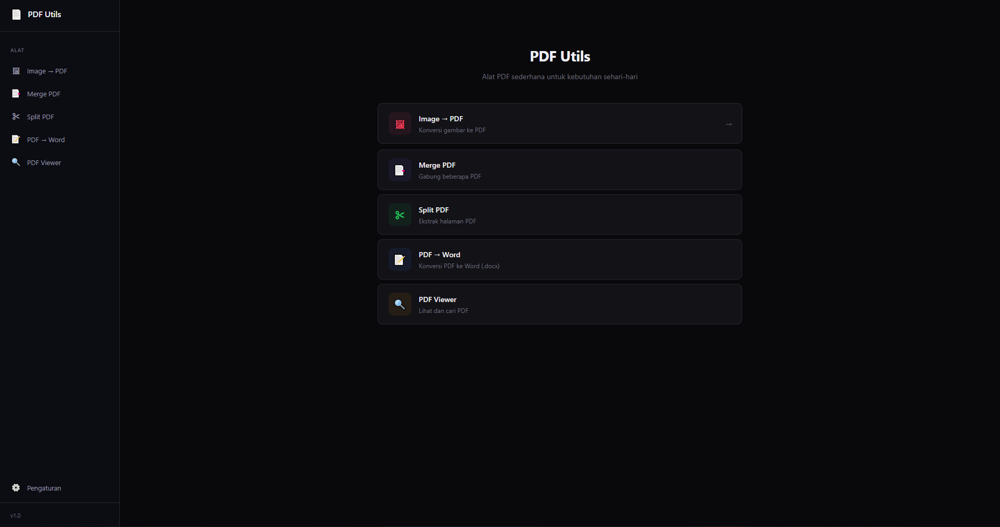

# 📄 PDF Utils

**PDF Utils** adalah aplikasi desktop ringan, cepat, dan modern yang dirancang untuk mempermudah berbagai keperluan pengolahan dokumen PDF Anda. Dibangun menggunakan teknologi **Tauri (Rust)** untuk backend yang super cepat dan hemat memori, serta **React (TypeScript)** untuk antarmuka pengguna yang interaktif dan dinamis.

 

## ✨ Fitur Utama

- 🖼️ **Image to PDF**: Konversi dan gabungkan beberapa gambar (PNG, JPG, WEBP, BMP) menjadi satu dokumen PDF dengan pengaturan ukuran otomatis (kertas A4).
- 🔗 **Merge PDF**: Gabungkan banyak file PDF secara berurutan menjadi satu file PDF utuh dengan mudah.
- ✂️ **Split PDF**: Ekstrak halaman-halaman tertentu dari sebuah dokumen PDF besar secara visual (thumbnail) dan simpan sebagai dokumen baru.
- 📝 **PDF to Word (.docx)**: Konversi dokumen PDF Anda menjadi format dokumen Microsoft Word yang dapat diedit secara penuh menggunakan algoritma ekstraksi tabel dan paragraf tingkat tinggi.
- 👁️ **PDF Viewer**: Penampil dokumen PDF bawaan (*built-in*) lengkap dengan fitur navigasi dan pencarian teks.
- 🌐 **Dukungan Multi-bahasa (i18n)**: Antarmuka yang tersedia dalam Bahasa Indonesia dan English.
- 🎨 **Tema Kustom (Accent Colors)**: Sesuaikan warna aplikasi sesuai selera Anda.
- ⚡ **Open Explorer After Export**: Otomatis membuka dan menyorot (*highlight*) file hasil konversi setelah proses berhasil.

---

## 🛠️ Requirements (Persyaratan Sistem)

Untuk menjalankan atau melakukan kompilasi (*build*) aplikasi ini dari kode sumber (*source code*), sistem Anda harus memenuhi beberapa persyaratan berikut:

### Persyaratan untuk Pengguna (User)
- Sistem Operasi: Windows 10/11, macOS, atau Linux.
- **Python 3.x**: Wajib terinstal di sistem Anda **khusus** untuk fitur konversi *PDF to Word*.
- Modul Python `pdf2docx`: Dibutuhkan oleh mesin konversi (jalankan perintah `pip install pdf2docx` di terminal/CMD).

### Persyaratan untuk Developer (Development)
- **Node.js** (v18 atau lebih baru) dan npm/yarn/pnpm.
- **Rust & Cargo** (v1.75 atau lebih baru): [Cara instalasi Rust](https://www.rust-lang.org/tools/install).
- (Khusus Windows) **Visual Studio C++ Build Tools** beserta komponen *Desktop development with C++*.
- (Khusus macOS) **Xcode Command Line Tools** (`xcode-select --install`).
- (Khusus Linux) **Dependensi sistem**: `libwebkit2gtk-4.0-dev`, `build-essential`, `curl`, `wget`, `file`, `libssl-dev`, `libgtk-3-dev`, `libayatana-appindicator3-dev`, `librsvg2-dev`.

---

## 🚀 Cara Menjalankan (Development)

1. **Kloning Repositori**
   ```bash
   git clone https://github.com/Eszuri/pdf-utils.git
   cd pdf-utils
   ```

2. **Instalasi Dependensi Frontend**
   ```bash
   npm install
   ```

3. **Jalankan Aplikasi dalam Mode Dev**
   ```bash
   npm run tauri dev
   ```

## 📦 Cara Mem-build (Production - Khusus Windows)

Untuk merakit aplikasi menjadi file *Installer* (`.msi` dan `.exe`) yang siap didistribusikan khusus di sistem Windows, ikuti langkah berikut:

### Persiapan Build Windows
1. Pastikan Anda telah menginstal **Visual Studio C++ Build Tools** (wajib untuk mengkompilasi *engine* Rust di Windows).
2. Jika Anda belum memiliki *Wix Toolset* (yang dibutuhkan Tauri untuk membuat file `.msi`), jalankan aplikasi Tauri sekali saja, dan Tauri akan mengunduhnya secara otomatis, ATAU Anda dapat mengunduhnya secara manual dari [wixtoolset.org](https://wixtoolset.org/).

### Eksekusi Build
Buka terminal (CMD / PowerShell) di dalam folder proyek, lalu jalankan:

```bash
npm run tauri build
```

Tunggu beberapa menit hingga proses kompilasi Rust dan pemaketan selesai. 
Hasil rakitan (*installer* Windows) akan tersedia di direktori:
👉 `src-tauri/target/release/bundle/msi/pdf-utils_1.0.0_x64_en-US.msi`

Aplikasi ini telah dioptimasi dengan pengaturan ukuran (code splitting pada Vite) dan optimasi biner Cargo (LTO, opt-level "s", strip) sehingga menghasilkan ukuran aplikasi *installer* Windows yang sangat ringan.

---

## 📚 Teknologi yang Digunakan

- **Frontend**: [React 19](https://react.dev/), [Vite](https://vitejs.dev/), [TypeScript](https://www.typescriptlang.org/), [Framer Motion](https://www.framer.com/motion/), [PDF.js](https://mozilla.github.io/pdf.js/)
- **Backend**: [Tauri v2](https://tauri.app/), [Rust](https://www.rust-lang.org/)
- **Pemroses PDF (Rust)**: `printpdf` (membuat PDF dari gambar), `lopdf` (merakit/memisahkan PDF).
- **Pemroses Word**: `pdf2docx` (Python).

---

## 📜 Lisensi

Aplikasi ini dilisensikan di bawah [MIT License](LICENSE). Anda bebas memodifikasi dan mendistribusikan ulang.
